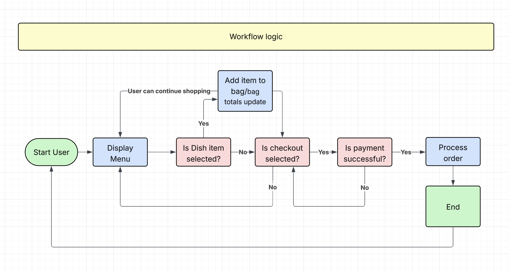
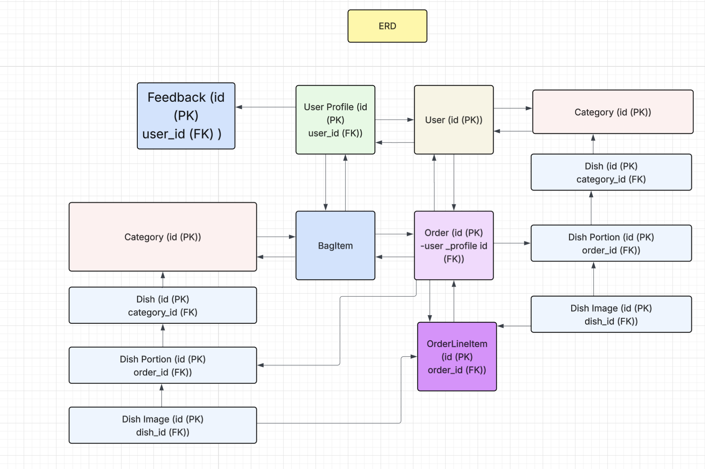

# Tarh TastyHub

Online Food Ordering & Restaurant Marketplace Platform

------
**Deployed website: [Link to website](https://tarh-tastyhub-4071346c00af.herokuapp.com/)**

**Card number for payment testing:** 4242 4242 4242 4242

------

## About

Tarh TastyHub is an online food ordering and restaurant marketplace platform that allows customers to browse restaurant, explore menu, place food orders, and pay securely online for delivery or pickup.

### Platform Features
- User authentication and account management.
- Dish browsing and search functionality. 
- Shopping bag and checkout flow.  
- Secure online payment.
- Discounts, promotions, and loyalty features.  
- Email notifications and order confirmations.
- News letter subcribsion for customer updates.
- Delivery riders, deliver food then its ready for delivery.

### Customer Capabilities
- Browse dishes across search options.  
- Apply delivery discounts.  
- Track order and delivery status.  
- Receive notifications when dishes are being prepared, ready for pickup or out for
  delivery and when delivery is complete. 

### Admin Dashboard
Tarh TastyHub supports multi-role admin dashboard management:  
- Add/edit/delete dish Category and dish.  
- Update order status and cencel oreder if not completed.
- View order details and print receipt. 
- Manage customer feedback. 

This role-based architecture ensures scalability and realistic real-world food delivery functionality.

---

## User Experience

Tarh TastyHub was designed to be modern, intuitive, and user-focused, prioritising ease of use for both customers and restaurant staff.

### Key UX Goals
- Clear and simple navigation  
- Fast access to food categories and dish listings  
- Smooth and frictionless ordering and checkout  

### Encouraging Repeat Usage
- Delivery discount
- Promotional campaigns by mailchimp subscripsion
- Email notifications  
- Dish availability

### Business UX
- Clear dashboard
- Order management tools  
- Staff permissions and access control  

---

## Target Audience

### Customers
- Individuals aged 18+  
- Busy professionals, students, and families  
- Users who value convenience and fast food ordering  
- Customers looking for discounts, quick checkout, and order tracking  

### Businesses
- Restaurant wanting to increase sales online  
- Small to medium food business scale
- Seeking a scalable food ordering solution

---

## User Stories

### First-Time Visitor

| Issue ID | User Story |
|----------|-----------|
| #1 | As a first-time visitor, I want to register an account so that I can place food orders. |
| #2 | As a first-time visitor, I want to understand the purpose of the platform immediately. |
| #3 | As a first-time visitor, I want easy navigation so that I can find menu quickly. |
| #4 | As a first-time visitor, I want to browse restaurant menus without logging in. |
| #5 | As a first-time visitor, I want clear validation messages when registering. |
| #6 | As a first-time visitor, I want to see available discount and dishes. |

### Registered User (Customer)

| Issue ID | User Story |
|----------|-----------|
| #7 | As a customer, I want to stay logged in so I can order faster. |
| #8 | As a customer, I want my personal and payment data to be secure. |
| #9 | As a customer, I want to view my profile and order history. |
| #10 | As a customer, I want to search for dishes|
| #11 | As a customer, I want to save delivery addresses. |
| #12 | As a customer, I want to filter food by category|
| #13 | As a customer, I want to leave reviews for dishes. |
| #14 | As a customer, I want to see featured dishes before ordering. |
| #17 | As a customer, I want to see all available dishes. |
| #18 | As a customer, I want to see discounts offers. |
| #19 | As a customer, I want to know when dishes are max out. |
| #20 | As a customer, I want to know when a dish is unavailable. |
| #21 | As a customer, I want to see full dish details|
| #22 | As a customer, I want to choose portion size|
| #23 | As a customer, I want to edit dish options before ordering. |
| #24 | As a customer, I want to see when a dish is available. |
| #25 | As a customer, I want to receive promotional email notifications. |
| #27 | As a customer, I want to see featured dishes. |
| #30 | As a customer, I want to adjust quantities in my bag. |
| #31 | As a customer, I want to add dishes to my bag. |
| #32 | As a customer, I want to see individual item totals. |
| #33 | As a customer, I want to see the total bag cost. |
| #34 | As a customer, I want to remove items from my bag. |
| #35 | As a customer, I want to track my order status. |
| #36 | As a customer, I want to see order confirmation after checkout. |
| #37 | As a customer, I want to receive an email confirmation of my order. |
| #38 | As a customer, I want to update my profile details. |
| #39 | As a customer, I want to manage multiple delivery |

### Restaurant Manager + Admin

| Issue ID | User Story |
|----------|-----------|
| #40 | As a manager, I want to manage food categories. |
| #41 | As a manager, I want to add, edit, and remove dishes. |
| #42 | As a manager, I want to manage tags (spicy, vegan, gluten-free). |
| #43 | As a manager, I want to manage dish ingredients. |
| #44 | As a manager, I want to send promotions to customers. |
| #45 | As a manager, I want to view customer data if needed. |
| #46 | As a manager, I want to cancel ordered dishes. |
| #48 | As an admin, I want to manage order statuses. |
| #52 | As a manager, I want customers to leave feedback. |

### Logistics / Delivery Manager + Admin

| Issue ID | User Story |
|----------|-----------|
| #53 | As a delivery manager, I want to update order delivery status. |

---

## Business Model

Tarh TastyHub follows a **B2C (Business-to-Customer)** business model:  
- Restaurants sell food directly to customers  
- Platform earns revenue through service fees and promotions  
- Focus on high-frequency, low-value transactions  

---

## Personas

### Customer Persona
- Busy individuals looking for quick meal solutions  
- Wide variety of food choices  
- Discounts benefits  
- Reliable order, pickup and delivery tracking  

### Restaurant Persona
- Seeking increase in sales online 
- Efficient order management  
- Improved customer engagement  
- Scalable food delivery and pickup solution  

---

## Web Marketing

### Email Marketing
- Newsletter campaigns  
- Promotional offers  
- Loyalty discount emails  
*Implemented using mailchimp.com.*

### Social Media
Facebook is a crucial platform for Tarh Tastyhub to connect with customers. According to statistics, the store enjoys strong reach among users who prefer Facebook, making it an effective channel for promoting products and engaging with potential buyers. Facebook’s extensive global coverage ensures access to a wide audience capable of purchasing food online.

The “Tarh Tastyhub” Facebook page serves as the restaurants’s marketing hub. It is used to post advertisements, share exciting content, and actively engage with users, helping to build brand awareness and foster customer interaction.

---

## Future Development
- Live chat support (Django Channels + Redis)  
- Advanced sorting by rating and popularity  
- Third-party authentication (Google login)  
- Additional payment methods (PayPal, Alipay, WeChat Pay, mobile phone)  
- Order cancellation workflow  
- ElasticSearch for faster and more accurate search  
- Advanced delivery cost calculation  
- Sales analytics and reporting dashboard  

---

## Technologies Used

**Languages:**  
Python 3.11.14, JavaScript, HTML5, CSS3  

**Frameworks & Libraries:**  
Django, jQuery, jQuery UI  

**Databases:**  
SQLite (development), PostgreSQL (production)  

**Tools & Services:**  
The project primarily uses Django as the web framework, with django-allauth for authentication and user management. For building and customizing forms, it leverages django-crispy-forms, crispy-bootstrap5, and django-widget-tweaks. PostgreSQL is used as the database, with psycopg2 as the adapter and dj-database-url for configuration. Redis handles caching, while django-ratelimit manages request limits. File storage and media management are supported via django-storages and boto3 for AWS S3 integration. HTTP requests are handled using requests, and payments are processed through Stripe. Deployment relies on Gunicorn, and Pillow is used for image processing. Additional utilities include asgiref, sqlparse, and various packaging and serialization tools like setuptools, wheel, and msgpack.

---

## Features

Full feature breakdown and validation can be found in:
[See TEATURES](FEATURES.md)

---

## Design

Tarh TastyHub follows Material Design principles to ensure clarity, consistency, and accessibility across a complex multi-role system.

The design emphasises:
- Clear navigation
- Visual hierarchy
- Minimal cognitive load
- Separation between customer and staff experiences

White space is intentionally used to improve readability, highlight primary actions, and support long browsing and management sessions.

---

## Wireframes

Wireframes were created to plan navigation flow, role separation, and the checkout process.

Wireframes are located in:

---

## Agile Methodology

### GitHub Project Management

Agile development was managed using GitHub Projects, enabling:
- User story prioritisation
- Sprint-based development
- Task tracking
- Progress visualisation

---

## Flowcharts

Flowchart can be seen here:

---

## Information Architecture

### Database

| Stage        | Database     |
|--------------|--------------|
| Development  | SQLite       |
| Production   | PostgreSQL   |

---

## Entity Relationship Diagram (ERD)

The ERD visualises all system relationships and data flow.

### UserProfile

* **id** (PK)
* **user_id** (FK → User.id)
* default_phone_number
* default_local
* default_postcode
* default_town_or_city
* default_street_address1
* default_street_address2
* default_county

### User

* **id** (PK)

### Order

* **id** (PK)
* user_profile_id (FK → UserProfile.id)
* order_number
* full_name
* email
* phone_number
* street_address1
* street_address2
* town_or_city
* county
* postcode
* local
* date
* delivery_type
* pickup_time
* status
* order_total
* grand_total
* delivery_fee
* stripe_pid
* original_bag
* public_tracking
* email_sent

### OrderLineItem

* **id** (PK)
* order_id (FK → Order.id)
* portion_id (FK → DishPortion.id)
* quantity
* price
* **Unique Constraint**: (order_id, portion_id)

### Category

* **id** (PK)
* name
* slug
* menu_type
* description
* icon

### Dish

* **id** (PK)
* category_id (FK → Category.id)
* name
* slug
* description
* ingredients
* dietary_info
* prep_time
* price
* calories
* image
* available
* is_special
* available_from
* available_until
* created
* updated

### DishPortion

* **id** (PK)
* dish_id (FK → Dish.id)
* size
* weight
* price
* **Unique Constraint**: (dish_id, size)

### DishImage

* **id** (PK)
* dish_id (FK → Dish.id)
* image
* alt_text

### Feedback

* **id** (PK)
* user_id (FK → User.id, optional)
* name
* email
* subject
* message
* created_at
* handled

---

## Data Models

---

### Checkout Models

This module defines the models for handling **customer orders** and **order line items** 
It manages delivery/pickup details, payment information, order status, and pricing.

#### Order

Automatically created when a user places an order.

| Field            | Type            | Validation / Notes |
|------------------|-----------------|------------------|
| user_profile      | ForeignKey      | UserProfile, null=True, blank=True, on_delete=SET_NULL, related_name="orders" |
| order_number      | CharField       | max_length=32, unique, default=generate_order_number() |
| full_name         | CharField       | max_length=50 |
| email             | EmailField      | Required |
| phone_number      | CharField       | max_length=20 |
| street_address1   | CharField       | max_length=80 |
| street_address2   | CharField       | max_length=80, blank=True |
| town_or_city      | CharField       | max_length=40 |
| county            | CharField       | max_length=80, blank=True |
| postcode          | CharField       | max_length=20, blank=True |
| local             | CharField       | max_length=80, blank=True |
| date              | DateTimeField   | auto_now_add=True |
| delivery_type     | CharField       | Choices: "delivery", "pickup", default="delivery" |
| pickup_time       | DateTimeField   | null=True, blank=True |
| status            | CharField       | Choices: "Pending", "Preparing", "Out for Delivery", "Completed", "Cancelled", default="Pending" |
| order_total       | DecimalField    | max_digits=10, decimal_places=2, default=0.00 |
| grand_total       | DecimalField    | max_digits=10, decimal_places=2, default=0.00 |
| delivery_fee      | DecimalField    | max_digits=6, decimal_places=2, default=0.00 |
| stripe_pid        | CharField       | max_length=254, null=True, blank=True |
| original_bag      | TextField       | null=True, blank=True |
| public_tracking   | BooleanField    | default=False |
| email_sent        | BooleanField    | default=False |

Orders are automatically deleted if their status is set to "Cancelled".
progress_percent provides a numeric completion percentage based on the order status.

---

#### OrderLineItem

Automatically created for each dish portion within an order.

| Field    | Type            | Validation / Notes |
|----------|-----------------|------------------|
| order    | ForeignKey      | Order, related_name="lineitems", on_delete=CASCADE |
| portion  | ForeignKey      | DishPortion, on_delete=CASCADE |
| quantity | PositiveIntegerField | default=1 |
| price    | DecimalField    | max_digits=8, decimal_places=2, default=0.00 |

Each combination of order and portion must be unique.
lineitem_total calculates the total cost for this line item (quantity × price).

---

#### Generally

- generate_order_number() creates a unique 12-character ID for tracking orders.
- Orders support both delivery and pickup, including optional pickup times.
- public_tracking allows optional visibility of order status to customers.
- Signals automatically delete cancelled orders to keep the database clean.
- Monetary values use DecimalField for precise calculations.

---

### Dishes Models

This module defines the models for **Dish, DishPortion, DishImage, and Category**.  
It handles categories, menu types, portions, pricing, and image compression.

---

#### Category

Automatically created when a new category is added.

| Field        | Type         | Validation / Notes |
|--------------|--------------|------------------|
| name         | CharField    | max_length=100, unique |
| slug         | SlugField    | max_length=100, unique, db_index=True |
| menu_type    | CharField    | Choices: Breakfast, Lunch, Dinner, Grill, Drinks; default=Breakfast |
| description  | TextField    | blank=True, null=True |
| icon         | ImageField   | upload_to='category_icons/', blank=True, null=True |

Categories are grouped by menu type and can have an optional icon. get_absolute_url() returns the category-specific dish list page.

---

#### Dish

Automatically created when a new dish is added.

| Field            | Type            | Validation / Notes |
|------------------|-----------------|------------------|
| category         | ForeignKey      | Category, related_name='dishes', on_delete=CASCADE |
| name             | CharField       | max_length=200 |
| slug             | SlugField       | max_length=200, db_index=True, autogenerated from name |
| description      | TextField       | Required |
| ingredients      | TextField       | blank=True, null=True |
| dietary_info     | CharField       | max_length=50, Choices: Vegetarian, Vegan, Gluten-Free, Spicy, None; blank=True, null=True |
| prep_time        | PositiveIntegerField | blank=True, null=True; minutes |
| price            | DecimalField    | max_digits=8, decimal_places=2, default=0.00, MinValueValidator(0.00) |
| calories         | PositiveIntegerField | blank=True, null=True |
| image            | ImageField      | upload_to='dishes/', blank=True, null=True; compressed automatically |
| available        | BooleanField    | default=True |
| is_special       | BooleanField    | default=False |
| available_from   | TimeField       | blank=True, null=True |
| available_until  | TimeField       | blank=True, null=True |
| created          | DateTimeField   | auto_now_add=True |
| updated          | DateTimeField   | auto_now=True |

get_absolute_url() returns the detail page for the dish.
display_price returns the price formatted as a string.
Dish images are automatically compressed on save.
A unique constraint ensures the (category, slug) combination is unique.

---

#### DishPortion

Automatically created for each portion of a dish.

| Field    | Type             | Validation / Notes |
|----------|-----------------|------------------|
| dish     | ForeignKey       | Dish, related_name='portions', on_delete=CASCADE |
| size     | CharField        | max_length=50; e.g., Small, Medium, Large |
| weight   | PositiveIntegerField | blank=True, null=True; weight in grams |
| price    | DecimalField     | max_digits=8, decimal_places=2, MinValueValidator(0.00) |

Each combination of dish and size must be unique.
The unit_price property returns the portion price.

---

#### DishImage

Automatically created for additional images of a dish.

| Field    | Type            | Validation / Notes |
|----------|-----------------|------------------|
| dish     | ForeignKey      | Dish, related_name='images', on_delete=CASCADE |
| image    | ImageField      | upload_to='dish_images/'; compressed automatically |
| alt_text | CharField       | max_length=150, blank=True, null=True |

Images are compressed automatically on save.
str() returns "Image for <dish name>".

---

#### Generally

- DishManager and DishQuerySet provide custom filtering for available dishes, prefetched portions and images, and filtering by menu type.
- All dish images are compressed using Pillow to optimize storage.
- Unique constraints and indexes improve query performance.
- Dietary information, availability times, and special flags allow menu customization.

### Feedback Models (Refered to as contact in templates)

This module defines the model for **user feedback submissions**.  
It supports an optional link to a user account, subject, message content, and handling status.

---

#### Feedback

Automatically created when a user submits feedback.

| Field       | Type          | Validation / Notes |
|------------|---------------|------------------|
| user       | ForeignKey    | User, null=True, blank=True, on_delete=SET_NULL |
| name       | CharField     | max_length=100 |
| email      | EmailField    | Required |
| subject    | CharField     | max_length=150 |
| message    | TextField     | Required |
| created_at | DateTimeField | auto_now_add=True |
| handled    | BooleanField  | default=False |

Feedback submissions are ordered by most recent first (created_at descending).
str() returns a combination of the sender's name and the subject for easy identification.

---

#### Generally

- Linking to a User is optional, allowing guests to submit feedback.
- Handled indicates whether the feedback has been addressed by staff.
- All messages are stored with the created_at timestamp for chronological tracking.

### Profiles Models

This module defines the **UserProfile** model, which stores additional profile information for users.

---

#### UserProfile

Automatically created when a user registers.

| Field                   | Type           | Validation / Notes                   |
|-------------------------|----------------|--------------------------------------|
| user                    | OneToOneField  | User, on_delete=CASCADE              |
| default_phone_number    | CharField      | max_length=20, null=True, blank=True |
| default_local           | CharField      | max_length=80, null=True, blank=True |
| default_postcode        | CharField      | max_length=20, null=True, blank=True |
| default_town_or_city    | CharField      | max_length=40, null=True, blank=True |
| default_street_address1 | CharField      | max_length=80, null=True, blank=True |
| default_street_address2 | CharField      | max_length=80, null=True, blank=True |
| default_county          | CharField      | max_length=80, null=True, blank=True |

'_ _str()_ _' returns "Profile of <username>".

---

#### Generally

- Each user has exactly one profile linked via a OneToOne relationship.
- Stores default address and contact information for order autofill and convenience.
- All fields are optional except the linked User.

---

## Testing

All testing documentation is available in:
[TESTING.md](TESTING.md)

Includes:
- User story validation
- Manual test cases
- Form validation
- Bug tracking

---

## Deployment and Payment Setup

| Component | Service |
|----------|---------|
| Hosting  | Heroku |
| Database | PostgreSQL |
| Payments | Stripe |

Stripe test card:
4242 4242 4242 4242

Deployment instructions are available in:
[DEPLOYMENT.md](DEPLOYMENT.md)

---

## Credits

- [GitHub](https://github.com/) for giving the idea of the project's design.
- [Django](https://www.djangoproject.com/) for the framework.
- [Font awesome](https://fontawesome.com/): for the free access to icons.
- [Render](https://render.com/): for providing a free hosting.
- [jQuery](https://jquery.com/): for providing varieties of tools to make standard HTML code look appealing.
- [jQuery UI](https://jqueryui.com/): for providing varieties of tools to make standard HTML code look appealing.
- [Postgresql](https://www.postgresql.org/): for providing a free database.
- [geonames](https://www.geonames.org/): for providing a free database on countries, regions, cities.
- [Multiple Video & Image Upload Plugin - jQuery Miv.js](https://www.jqueryscript.net/form/multi-video-image-upload.html): for providing a free plugin to upload multiple videos and images.
- [Stripe](https://stripe.com/): for providing a free payment gateway.
- [htmlcolorcodes.com](https://htmlcolorcodes.com/): for providing a free database on colors.
- [Very Academy Youtube Channel](https://www.youtube.com/c/veryacademy): for brilliant tutorials, which shed the light on the implementation of database with multi-values products, precise explanations of the stripe API, and many other things!
- [birme](https://www.birme.net/): for providing free service to center and crop images.
- [fontawesome](https://fontawesome.com/): for providing free icons.
- [googlefonts](https://fonts.google.com/): for providing free fonts.
- [BGJar](https://www.bgjar.com/): for the free access to the background images build tool.
- [Responsive Viewer](https://chrome.google.com/webstore/detail/responsive-viewer/inmopeiepgfljkpkidclfgbgbmfcennb/related?hl=en): for providing a free platform to test website responsiveness
- [GoFullPage](https://gofullpage.com/): for allowing to create free full web page screenshots;
- [Favicon Generator. For real.](https://realfavicongenerator.net/): for providing a free platform to generate favicons.
- [Sitemap Generator](https://www.xml-sitemaps.com/): for providing a free platform to generate sitemaps.
- [Coolors](https://coolors.co/): for providing a free platform to generate your own palette.
- [Elon Musk](https://twitter.com/elonmusk?ref_src=twsrc%5Egoogle%7Ctwcamp%5Eserp%7Ctwgr%5Eauthor): for providing a template for the twitter mock-up page;

### Content and Images

- [unsplash](https://unsplash.com/): for providing a free products' images.
- [Icons8](https://icons8.com/): for providing free access to amazing icons and illustrations to fill out the store.
- [unsplash](https://unsplash.com/): for providing free products' images to fill out the store.
- [chrome developer tools](https://developer.chrome.com/extensions/devtools_inspector): for providing a free platform to test website.
- [adidas](https://www.adidas.com/): for providing free products' data and images to fill out the store on clothes and shoes.
- [fashionunited](https://www.fashionunited.com/): for providing content for the newsletter;
- [dell](https://www.dell.com/): for providing free products' data and images to fill out the store on computers and laptops.
- [nike](https://www.nike.com/): for providing free products' data and images to fill out the store on clothes and shoes.
- [artsaber](https://www.artsabers.com/): for providing free products' images to fill out the store on lightsabers data and images.
- [backwaterreptiles](https://www.backwaterreptiles.com/): for providing free products' images to fill out the store on tarantulas' data and images.
- [Yum Of China](https://www.yumofchina.com/chinese-beer/): for providing free data on Chinese beer.
- [lego](https://www.lego.com/): for providing free products' data and images to fill out the store with toys.
- [maggie](https://www.maggie.com/): for providing free products' data and images to fill out the store with maggie products.
- [barilla](https://www.barilla.com/): for providing free products' data and images to fill out the store with pasta.
- [LG electronics](https://www.lg.com/): for providing free products' data and images to fill out the store with electronics.
---

## Acknowledgments

- [Tim Nelson](https://github.com/TravelTimN) was a great supporter of another bold idea of mine for this project. Tim guided me through the development of the project and helped me to learn a lot of new things by challenging me to do something new.
- [Aleksei Konovalov](https://github.com/lexach91), my husband and coding partner, assisted me greatly in product values js selection control implementation and helped me to stay sane.
- [Very Academy Youtube Channel](https://www.youtube.com/c/veryacademy) provided great insight on the implementation of the database 