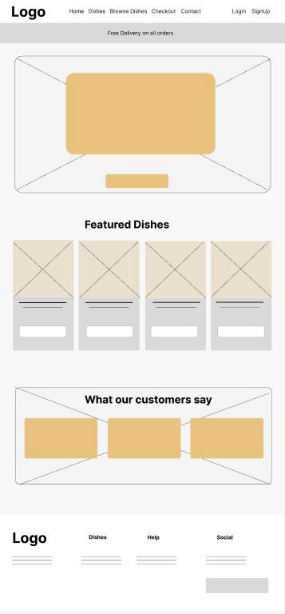
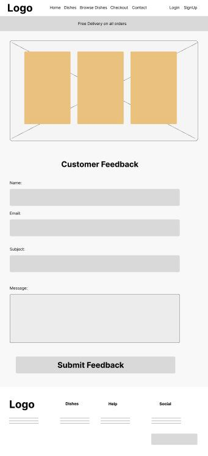
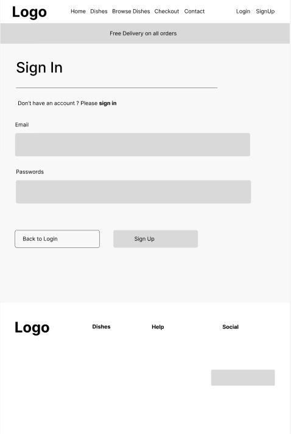
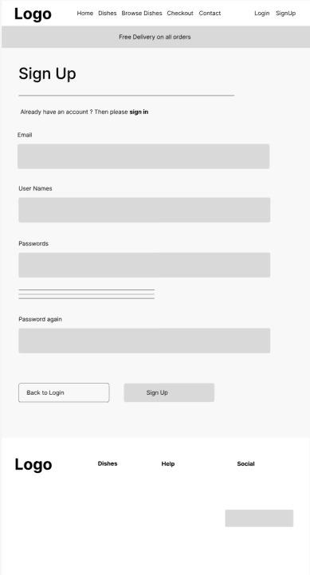

# Tarh TastyHub

Online Food Ordering & Restaurant Marketplace Platform

------
**Deployed website: [Link to website](https://tarh-tastyhub-4071346c00af.herokuapp.com/)**

------

## About

Tarh TastyHub is an online food ordering and restaurant marketplace platform that allows customers to browse restaurant menu, explore the menu, create an account , place food orders, and pay securely online for delivery or pickup.

### Platform Features
- User authentication and account management.
- Dish browsing and search functionality. 
- Shopping bag and checkout flow.  
- Secure online payment.
- Discounts, and featured dishes.  
- Email notifications and order confirmations.
- Newsletter subcription for customer updates.
- Delivery riders, deliver food when its ready for delivery.

### Customer Capabilities
- Browse dishes across search options.  
- Apply delivery discounts.  
- Track order and delivery or pickup status.  
- Receive notifications when dishes are being prepared, ready for pickup or out for
  delivery and when delivery is complete. 

### Admin Dashboard
Tarh TastyHub supports multi-role admin dashboard management:  
- Add/edit/delete dish Category and dish.  
- Update order status and cancel order if not completed.
- View order details and print receipt. 
- Cancel orders when not completed.
- Manage customer feedback. 

This role-based architecture ensures scalability and realistic real-world food delivery functionality.

---

## User Experience

Tarh TastyHub was designed to be modern, intuitive, and user-focused, prioritising ease of use for both customers and restaurant staff.

### Key UX Goals
- Clear and simple navigation  
- Fast access to food categories and dish listings  
- Smooth and frictionless ordering and checkout  

### Encouraging Repeat Usage
- Delivery discount
- Promotional campaigns by mailchimp subscription
- Email notifications  
- Dish availability

### Business UX
- Clear dashboard
- Order management system 
- Staff access control  

---

## Target Audience

### Customers
- Individuals aged 18+  
- Busy professionals, students, and families  
- Users who value convenience and fast food ordering  
- Customers looking for discounts, quick checkout, and order tracking  

### Businesses
- Restaurant seeking to increase sales online  
- Small to medium food business scale
- Seeking a scalable food ordering solution

---

## User Stories

### User Stories Backlog

| ID   | User Story | Priority | Acceptance Criteria | Story Points |
|------|-----------|---------|-------------------|--------------|
| US01 | As a User, I want to view a list of dishes, so that I can select some to order. | Must-Have | User can see all available dishes with name, price, image, and rating. | 1 |
| US02 | As a User, I want to view dishes by category (e.g., Breakfast, Lunch, Dinner), so that I can quickly find what I want. | Must-Have | Categories are displayed; clicking a category filters dishes correctly. | 1 |
| US03 | As a User, I want to view details of a dish, so that I can see description, ingredients, image, portion size, and price. | Must-Have | Clicking a dish shows detailed information. | 1 |
| US04 | As a User, I want to identify featured dishes, so that I can take advantage of offers. | Should-Have | Featured dishes are visually highlighted on the home page. |  |
| US05 | As a User, I want to view my total order cost at any time, so that I can manage my budget. | Must-Have| Total cost updates automatically when items are added/removed. | 1 |
| US06 | As a User, I want to register an account, so that I can save my details and order history. | Must-Have | Registration form validates email, password, and required fields. | 1 |
| US07 | As a User, I want to log in and log out, so that my account is secure. | Must-Have | User can log in/out; protected pages require login. | 1 |
| US08 | As a User, I want to recover my password, so that I can regain access if I forget it. | Must-Have| Password reset emails are sent, and new password can be set. | 1 |
| US09 | As a User, I want to receive email confirmation after registering, so that I know my account is created. | Should-Have | Confirmation email is sent with a verification link. | 1 |
| US10 | As a User, I want a personalised profile, so that I can view order history, saved addresses, and preferences. | Should-Have | Profile shows previous orders, saved addresses, and editable personal info. | 1 |
| US11 | As a User, I want to sort dishes by price, so that I can find the best options. | Should-Have | Sorting updates the list correctly and instantly. | 1 |
| US12 | As a User, I want to sort dishes within a category, so that I can find the top-rated or best-priced dishes in that category. | Should-Have | Category filter + sort works correctly. | 1 |
| US13 | As a User, I want to search for dishes by name or ingredients, so that I can quickly find what I want. | Should-Have | Search returns relevant dishes, displays number of results. | 1 |
| US14 | As a User, I want to view search results clearly, so that I can decide whether the dish I want is available. | Should-Have| Search results show dish name, image, price, and category. | 1 |
| US15 | As a User, I want to select portion size and quantity for each dish, so that I order exactly what I want. | Must-Have | Size/portion options and quantity selector update the cart correctly. | 1 |
| US16 | As a User, I want to view all dishes in my bag, so that I can confirm my selections. | Must-Have | bag page lists all dishes with quantity, size, and subtotal. | 1 |
| US17 | As a User, I want to adjust quantities or remove dishes in my bag, so that I can change my order easily. | Must-Have | Quantity adjustments and deletions update total instantly. | 1 |
| US18 | As a User, I want to enter payment information securely, so that I can complete my order safely. | Must-Have | Payment form validates inputs; supports secure payment gateways. | 1 |
| US19 | As a User, I want to see order confirmation after checkout, so that I know my order was successful. | Must-Have | Confirmation page displays order number, summary, and estimated delivery. | 1 |
| US20 | As a User, I want to receive an email confirmation after checkout, so that I can keep a record of my order. | Must-Have | Confirmation email sent with order details. | 1 |
| US21 | As an admin, I want to add new dishes, so that I can expand my menu. | Must-Have| Admin can create dishes with name, description, category, price, image, and availability. | 1 |
| US22 | As an admin, I want to edit dish details, so that I can update pricing, images, descriptions, or availability. | Must-Have | Admin can update dishes and order delivery status; changes reflected on the front-end immediately. | 1 |
| US23 | As an admin, I want to delete dishes, so that I can remove items no longer offered. | Must-Have | Deletion removes dish from menu and prevents future orders. | 1 |
| US24 | As a User, I want to submit feedback, so that I can share my opinion or report issues. | Should-Have | Feedback form stores comments associated with user. | 1 |
| US25 | As a User, I want to update my profile, so that my personal information and delivery preferences are current. | Should-Have | Users can edit name, email, phone, address, and password. | 1 |
| US26 | As a User, I want to view past orders, so that I can reference previous dishes I liked. | Should-Have | Past orders show dish names, quantities, prices, and order date. | 1 |
| US27 | As a User, I want to delete my account, so that my personal data and order history are removed. | Could-Have| Account deletion requires confirmation; data removed from system. | 1 |
| US28 | As a User, I want to change my password, so that I can maintain account security. | Should-Have| Users can set a new password; validation applied. | 1 |
| US29 | As a User, I want to register an account using my phone number | Won't-Have| Registration form validates phone number. | 1 |

## Business Model

Tarh TastyHub follows a **B2C (Business-to-Customer)** business model:  
- Restaurants sell food directly to customers  
- Restaurant earns more revenue through increase online sales and promotions  
- Focus on high-frequency, low-value transactions  

---

## Personas

### Customer Persona
- Busy individuals looking for quick meal solutions  
- Wide variety of food choices  
- Discounts benefits  
- Reliable order, pickup and delivery tracking  

### Restaurant Persona
- Seeking increase in sales online 
- Efficient order management  
- Improved customer engagement  
- Scalable food delivery and pickup solution  

---

## Web Marketing

### Email Marketing
- Newsletter campaigns  
- Promotional offers  
- Loyalty discount emails  
*Implemented using mailchimp.com.*

### Social Media

Facebook is a crucial platform for Tarh Tastyhub to connect with customers. According to statistics, the store enjoys strong reach among users who prefer Facebook, making it an effective channel for promoting products and engaging with potential buyers. Facebook’s extensive global coverage ensures access to a wide audience capable of purchasing food online.

The “Tarh Tastyhub” Facebook page serves as the restaurant’s marketing hub. It is used to post advertisements, share exciting content, and actively engage with users, helping to build brand awareness and foster customer interaction.

---

## Future Development

- Live chat support (Django Channels + Redis)  
- Advanced sorting by rating and popularity  
- Third-party authentication (Google login)  
- Additional payment methods (PayPal, Alipay, WeChat Pay, Apple pay)  
- Order cancellation workflow  
- ElasticSearch for faster and more accurate search  
- Advanced delivery cost calculation  
- Sales analytics and reporting dashboard

---

## Technologies Used

**Languages:**  

- Backend
  + Python 3.11.14
- Frontend
  + HTML
  + CSS
  + JavaScript
  + Stripe Elements

**Frameworks & Libraries:**  

Django, jQuery, jQuery UI  

**Databases:**  
SQLite (development), PostgreSQL (production)  

**Tools & Services:**  

The project primarily uses Django as the web framework, with django-allauth for authentication and user management. For building and customizing forms, it leverages django-crispy-forms, crispy-bootstrap5, and django-widget-tweaks. PostgreSQL is used as the database, with psycopg2 as the adapter and dj-database-url for configuration. Redis handles caching, while django-ratelimit manages request limits. File storage and media management are supported via django-storages and boto3 for AWS S3 integration. HTTP requests are handled using requests, and payments are processed through Stripe. Deployment relies on Gunicorn, and Pillow is used for image processing. Additional utilities include asgiref, sqlparse, and various packaging and serialisation tools like setuptools, wheel, and msgpack.

---

## Features

Full feature breakdown and validation can be found in:
[See FEATURES.md](FEATURES.md)

---

## Design

Tarh TastyHub follows Material Design principles to ensure clarity, consistency, and accessibility across a complex multi-role system.

The design emphasises:
- Clear navigation
- Visual hierarchy
- Minimal cognitive load
- Separation between customer and staff experiences

White space is intentionally used to improve readability, highlight primary actions, and support long browsing and management sessions.

---

## Wireframes

Wireframes were created to plan navigation flow.

- Wireframes for Home page:

- Wireframes for Browse Dishws page:

- Wireframes for Contact page:

- Wireframes for Signin page:

- Wireframes for Signup page:

---

## Agile Methodology

### GitHub Project Management

Agile development was managed using GitHub Projects, enabling:
- User story prioritisation
- Sprint-based development
- Task tracking
- Progress visualisation

---

## Flowcharts

Flowchart can be seen here:

---

## Information Architecture

### Database

| Stage        | Database     |
|--------------|--------------|
| Development  | SQLite       |
| Production   | PostgreSQL   |

---

## Entity Relationship Diagram (ERD)

The ERD visualises all system relationships and data flow.

### UserProfile

|     User       |
|----------------|
| id (PK)        |

        |
        | 1 — 1
        |

|        UserProfile          |
|-----------------------------|
| id (PK)                     |
| user_id (FK)                |
| default_phone_number        |
| default_local               |
| default_postcode            |
| default_town_or_city        |
| default_street_address1     |
| default_street_address2     |
| default_county              |

- Relationship
    + User 1 - 1 UserProfile
       * Each User can have exactly one UserProfile.
       * Each UserProfile belongs to exactly one User.

### Order

|              Order               |
|----------------------------------|
| id (PK)                           |
| user_profile_id (FK)              |
| order_number                      |
| full_name                         |
| email                             |
| phone_number                      |
| street_address1                   |
| street_address2                   |
| town_or_city                      |
| county                            |
| postcode                          |
| local                             |
| date                              |
| delivery_type                     |
| pickup_time                       |
| status                            |
| order_total                       |
| delivery_fee                      |
| grand_total                       |
| stripe_pid                        |
| original_bag                      |
| public_tracking                   |
| email_sent                        |

- Relationship: 
     + UserProfile 1 -- * Order
        * One UserProfile can place many Orders.
        * Each Order belongs to exactly one UserProfile.

### OrderLineItem

|          OrderLineItem            |
|----------------------------------|
| id (PK)                           |
| order_id (FK)                     |
| portion_id (FK)                   |
| quantity                          |
| price                             |
| UNIQUE(order_id, portion_id)      |

- Relationship: 
     + Order 1 -- * OrderLineItem
        * One Order can contain many OrderLineItems
        * Each OrderLineItem belongs to exactly one Order
     + DishPortion 1 -- * OrderLineItem
        * One DishPortion can appear in many OrderLineItems
        * Each OrderLineItem refers to exactly one DishPortion

### Category/Dish

|     Category       |
|--------------------|
| id (PK)            |
| name               |
| slug               |
| menu_type          |
| description        |
| icon               |

        |
        | 1 — *
        |

|              Dish                |
|----------------------------------|
| id (PK)                           |
| category_id (FK)                  |
| name                              |
| slug                              |
| description                       |
| ingredients                       |
| dietary_info                      |
| prep_time                         |
| price                             |
| calories                          |
| image                             |
| available                         |
| is_special                        |
| available_from                    |
| available_until                   |
| created                           |
| updated                           |

- Relationship Explained
    + Category 1 -- * Dish
        * One Category can contain many Dishes
        * Each Dish belongs to exactly one Category

### DishPortion/DishImage

|           DishPortion             |
|-----------------------------------|
| id (PK)                           |
| dish_id (FK)                      |
| size                              |
| weight                            |
| price                             |
| UNIQUE(dish_id, size)             |

|          DishImage             |
|--------------------------------|
| id (PK)                        |
| dish_id (FK)                   |
| image                          |
| alt_text                       |

- Relationship: 
    + Dish 1 -- * DishPortion
        * One Dish can have many DishPortions
        * Each DishPortion belongs to exactly one Dish
    + Dish 1 -- * DishImage
        * One Dish can have many images
        * Each DishImage belongs to exactly one Dish

### Feedback

|            Feedback               |
|-----------------------------------|
| id (PK)                           |
| user_id (FK, optional)            |
| name                              |
| email                             |
| subject                           |
| message                           |
| created_at                        |
| handled                           |

-  Relationship:
    + User 1 -- * Feedback (optional)
        * One User can be associated with many Feedback entries
        * Each Feedback entry can be associated with at most one User
        * A feedback entry does not have to be linked to a user

---

## Data Models

---

### Checkout Models

This module defines the models for handling **customer orders** and **order line items** 
It manages delivery/pickup details, payment information, order status, and pricing.

#### Order

Automatically created when a user places an order.

| Field            | Type            | Validation / Notes |
|------------------|-----------------|------------------|
| user_profile      | ForeignKey      | UserProfile, null=True, blank=True, on_delete=SET_NULL, related_name="orders" |
| order_number      | CharField       | max_length=32, unique, default=generate_order_number() |
| full_name         | CharField       | max_length=50 |
| email             | EmailField      | Required |
| phone_number      | CharField       | max_length=20 |
| street_address1   | CharField       | max_length=80 |
| street_address2   | CharField       | max_length=80, blank=True |
| town_or_city      | CharField       | max_length=40 |
| county            | CharField       | max_length=80, blank=True |
| postcode          | CharField       | max_length=20, blank=True |
| local             | CharField       | max_length=80, blank=True |
| date              | DateTimeField   | auto_now_add=True |
| delivery_type     | CharField       | Choices: "delivery", "pickup", default="delivery" |
| pickup_time       | DateTimeField   | null=True, blank=True |
| status            | CharField       | Choices: "Pending", "Preparing", "Out for Delivery", "Completed", "Cancelled", default="Pending" |
| order_total       | DecimalField    | max_digits=10, decimal_places=2, default=0.00 |
| grand_total       | DecimalField    | max_digits=10, decimal_places=2, default=0.00 |
| delivery_fee      | DecimalField    | max_digits=6, decimal_places=2, default=0.00 |
| stripe_pid        | CharField       | max_length=254, null=True, blank=True |
| original_bag      | TextField       | null=True, blank=True |
| public_tracking   | BooleanField    | default=False |
| email_sent        | BooleanField    | default=False |

Orders are automatically deleted if their status is set to "Cancelled".
progress_percent provides a numeric completion percentage based on the order status.

---

#### OrderLineItem

Automatically created for each dish portion within an order.

| Field    | Type            | Validation / Notes |
|----------|-----------------|------------------|
| order    | ForeignKey      | Order, related_name="lineitems", on_delete=CASCADE |
| portion  | ForeignKey      | DishPortion, on_delete=CASCADE |
| quantity | PositiveIntegerField | default=1 |
| price    | DecimalField    | max_digits=8, decimal_places=2, default=0.00 |

Each combination of order and portion must be unique.
lineitem_total calculates the total cost for this line item (quantity × price).

---

#### Notes

- generate_order_number() creates a unique 12-character ID for tracking orders.
- Orders support both delivery and pickup, including optional pickup times.
- public_tracking allows optional visibility of order status to customers.
- Signals automatically delete cancelled orders to keep the database clean.
- Monetary values use DecimalField for precise calculations.

---

### Dishes Models

This module defines the models for **Dish, DishPortion, DishImage, and Category**.  
It handles categories, menu types, portions, pricing, and image compression.

---

#### Category

Automatically created when a new category is added.

| Field        | Type         | Validation / Notes |
|--------------|--------------|------------------|
| name         | CharField    | max_length=100, unique |
| slug         | SlugField    | max_length=100, unique, db_index=True |
| menu_type    | CharField    | Choices: Breakfast, Lunch, Dinner, Grill, Drinks; default=Breakfast |
| description  | TextField    | blank=True, null=True |
| icon         | ImageField   | upload_to='category_icons/', blank=True, null=True |

Categories are grouped by menu type and can have an optional icon. get_absolute_url() returns the category-specific dish list page.

---

#### Dish

Automatically created when a new dish is added.

| Field            | Type            | Validation / Notes |
|------------------|-----------------|------------------|
| category         | ForeignKey      | Category, related_name='dishes', on_delete=CASCADE |
| name             | CharField       | max_length=200 |
| slug             | SlugField       | max_length=200, db_index=True, autogenerated from name |
| description      | TextField       | Required |
| ingredients      | TextField       | blank=True, null=True |
| dietary_info     | CharField       | max_length=50, Choices: Vegetarian, Vegan, Gluten-Free, Spicy, None; blank=True, null=True |
| prep_time        | PositiveIntegerField | blank=True, null=True; minutes |
| price            | DecimalField    | max_digits=8, decimal_places=2, default=0.00, MinValueValidator(0.00) |
| calories         | PositiveIntegerField | blank=True, null=True |
| image            | ImageField      | upload_to='dishes/', blank=True, null=True; compressed automatically |
| available        | BooleanField    | default=True |
| is_special       | BooleanField    | default=False |
| available_from   | TimeField       | blank=True, null=True |
| available_until  | TimeField       | blank=True, null=True |
| created          | DateTimeField   | auto_now_add=True |
| updated          | DateTimeField   | auto_now=True |

get_absolute_url() returns the detail page for the dish.
display_price returns the price formatted as a string.
Dish images are automatically compressed on save.
A unique constraint ensures the (category, slug) combination is unique.

---

#### DishPortion

Automatically created for each portion of a dish.

| Field    | Type             | Validation / Notes |
|----------|-----------------|------------------|
| dish     | ForeignKey       | Dish, related_name='portions', on_delete=CASCADE |
| size     | CharField        | max_length=50; e.g., Small, Medium, Large |
| weight   | PositiveIntegerField | blank=True, null=True; weight in grams |
| price    | DecimalField     | max_digits=8, decimal_places=2, MinValueValidator(0.00) |

Each combination of dish and size must be unique.
The unit_price property returns the portion price.

---

#### DishImage

Automatically created for additional images of a dish.

| Field    | Type            | Validation / Notes |
|----------|-----------------|------------------|
| dish     | ForeignKey      | Dish, related_name='images', on_delete=CASCADE |
| image    | ImageField      | upload_to='dish_images/'; compressed automatically |
| alt_text | CharField       | max_length=150, blank=True, null=True |

Images are compressed automatically on save.
str() returns "Image for <dish name>".

---

#### Notes

- DishManager and DishQuerySet provide custom filtering for available dishes, prefetched portions and images, and filtering by menu type.
- All dish images are compressed using Pillow to optimize storage.
- Unique constraints and indexes improve query performance.
- Dietary information, availability times, and special flags allow menu customization.

### Feedback Models (Refered to as contact in templates)

This module defines the model for **user feedback submissions**.  
It supports an optional link to a user account, subject, message content, and handling status.

---

#### Feedback

Automatically created when a user submits feedback.

| Field       | Type          | Validation / Notes |
|------------|---------------|------------------|
| user       | ForeignKey    | User, null=True, blank=True, on_delete=SET_NULL |
| name       | CharField     | max_length=100 |
| email      | EmailField    | Required |
| subject    | CharField     | max_length=150 |
| message    | TextField     | Required |
| created_at | DateTimeField | auto_now_add=True |
| handled    | BooleanField  | default=False |

Feedback submissions are ordered by most recent first (created_at descending).
str() returns a combination of the sender's name and the subject for easy identification.

---

#### Notes

- Linking to a User is optional, allowing guests to submit feedback.
- Handled indicates whether the feedback has been addressed by staff.
- All messages are stored with the created_at timestamp for chronological tracking.

### Profiles Models

This module defines the **UserProfile** model, which stores additional profile information for users.

---

#### UserProfile

Automatically created when a user registers.

| Field                   | Type           | Validation / Notes                   |
|-------------------------|----------------|--------------------------------------|
| user                    | OneToOneField  | User, on_delete=CASCADE              |
| default_phone_number    | CharField      | max_length=20, null=True, blank=True |
| default_local           | CharField      | max_length=80, null=True, blank=True |
| default_postcode        | CharField      | max_length=20, null=True, blank=True |
| default_town_or_city    | CharField      | max_length=40, null=True, blank=True |
| default_street_address1 | CharField      | max_length=80, null=True, blank=True |
| default_street_address2 | CharField      | max_length=80, null=True, blank=True |
| default_county          | CharField      | max_length=80, null=True, blank=True |

'_ _str()_ _' returns "Profile of <username>".

---

#### Notes

- Each user has exactly one profile linked via a OneToOne relationship.
- Stores default address and contact information for order autofill and convenience.
- All fields are optional except the linked User.

---

## Testing

All testing documentation is available in:

[See TESTING.md](TESTING.md)

Includes:
- User story validation
- Manual test cases
- Form validation
- Bug tracking

---

## Deployment and Payment Setup

| Component | Service |
|----------|---------|
| Hosting  | Heroku |
| Database | PostgreSQL |
| Payments | Stripe |

Stripe test card:
4242 4242 4242 4242

Deployment instructions are available in:

[See DEPLOYMENT.md](DEPLOYMENT.md)

## Credits

- [GitHub](https://github.com/) for giving the idea of the project's design.
- [Django](https://www.djangoproject.com/) for the framework.
- [Heroku](https://www.heroku.com/): for the hosting of the website.
- [Font awesome](https://fontawesome.com/): for the free access to icons.
- [Git](https://git-scm.com/): the version control system used to manage the code.
- [Pip3](https://pypi.org/project/pip/): the package manager used to install the
  dependencies.
- [Gunicorn](https://gunicorn.org/): the webserver used to run the website.
- [jQuery](https://jquery.com/): for providing varieties of tools to make standard HTML
  code look appealing.
- [jQuery UI](https://jqueryui.com/): for providing varieties of tools to make standard
  HTML code look appealing.
- [Postgresql](https://www.postgresql.org/): for providing database.
- [Stripe](https://stripe.com/): for providing a free payment gateway.
- [AWS Amazon](https://aws.amazon.com/): for media and static file storage.
- [fontawesome](https://fontawesome.com/): for providing free icons.
- [googlefonts](https://fonts.google.com/): for providing free fonts.
- [Django-allauth](https://django-allauth.readthedocs.io/en/latest/): the authentication
  library used to create the user accounts.
- [Django-crispy-forms](https://django-cryptography.readthedocs.io/en/latest/): was used
  to control the rendering behavior of Django forms.
- [VSCode](https://code.visualstudio.com/): the IDE used to develop the website.
- [Chrome DevTools](https://developer.chrome.com/docs/devtools/open/): was used to debug
  the website.
- [Mailchimp](https://login.mailchimp.com/): for email providing email subscription.
- [Font Awesome](https://fontawesome.com/): was used to create the icons used in the
  website.
- [W3C Validator](https://validator.w3.org/): was used to validate HTML5 code for the
  website.
- [W3C CSS validator](https://jigsaw.w3.org/css-validator/): was used to validate CSS code
  for the website.
- [CI Python Linter](https://pep8ci.herokuapp.com/): was used to validate Python code for the website.
- [Compress JPEG](https://compressjpeg.com/) was used to compress JPEG images.
- [IMGonline.com.ua](https://www.imgonline.com.ua/eng/resize-image.php) was used to resize
  images.
- [FAVICON GENERATOR](https://favicon.io/) was used to generate the favicon.
- [Figma](https://www.figma.com/) was used to build website wireframes.
- [Responsive Viewer](https://chrome.google.com/webstore/detail/responsive-viewer/inmopeiepgfljkpkidclfgbgbmfcennb/related?hl=en): for providing a free platform to test website responsiveness
- [Sitemap Generator](https://www.xml-sitemaps.com/): for providing a free platform to
  generate sitemaps.
- [Juliia Konovalova](https://github.com/IuliiaKonovalova/e-commerce/blob/main/README.md) was used in the writing of the readme.md.
- [Compress JPEG](https://compressjpeg.com/) was used to compress JPEG images.
- [IMGonline.com.ua](https://www.imgonline.com.ua/eng/resize-image.php) was used to resize images.
- [You Tube Video](https://www.google.com/search?sca_esv=65998f3cafbd16fe&udm=7&fbs=AIIjpHxU7SXXniUZfeShr2fp4giZ1Y6MJ25_tmWITc7uy4KIeoJTKjrFjVxydQWqI2NcOhYPURIv2wPgv_w_sE_0Sc6QqqU7k8cSQndc5mTXCIWHa5VI1yMxIvn_0W11438Uhn0KUB0OyyqdxtMTNJnktIk9lQeAou6u0TG1ZnPmcPkpqk3LcE4bSX7s88nmTrtoPEA9SVU_&q=building+e+commerce+restaurant+website&sa=X&ved=2ahUKEwjLle__7vGRAxW1MRAIHaeDFxMQtKgLegQIFxAB&biw=1440&bih=812&dpr=2#fpstate=ive&ip=1&vld=cid:6eabdc37,vid:oAuMO8cWY4o,st:0) was used for additional insight to e commerce food website.
- [Code Institute](https://codeinstitute.net/) boutique-ado walkthrough project was used
   in building my project.

---

## Acknowledgments

- [Code Institute](https://codeinstitute.net/) Tutors and my Mentor, Juliia Konovalova for their continuous support.