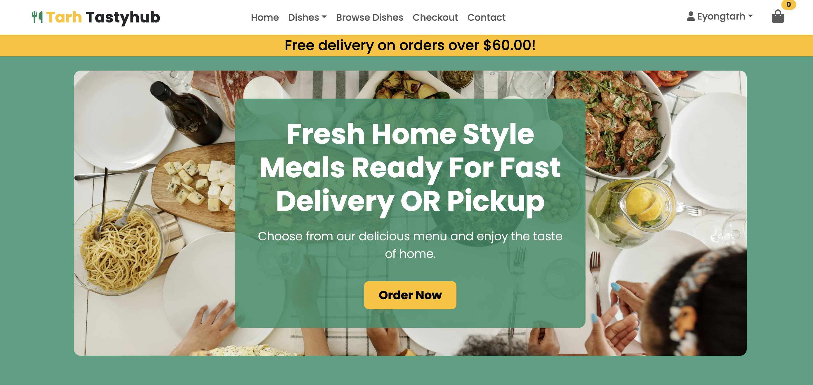
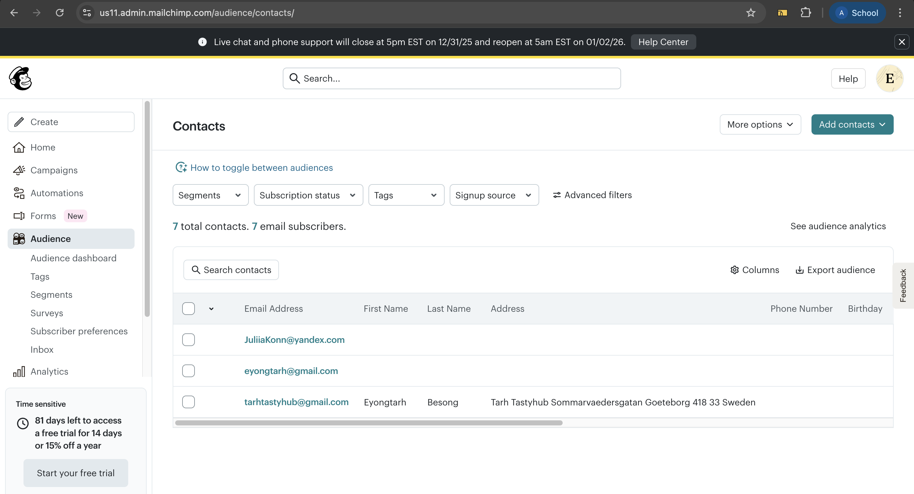
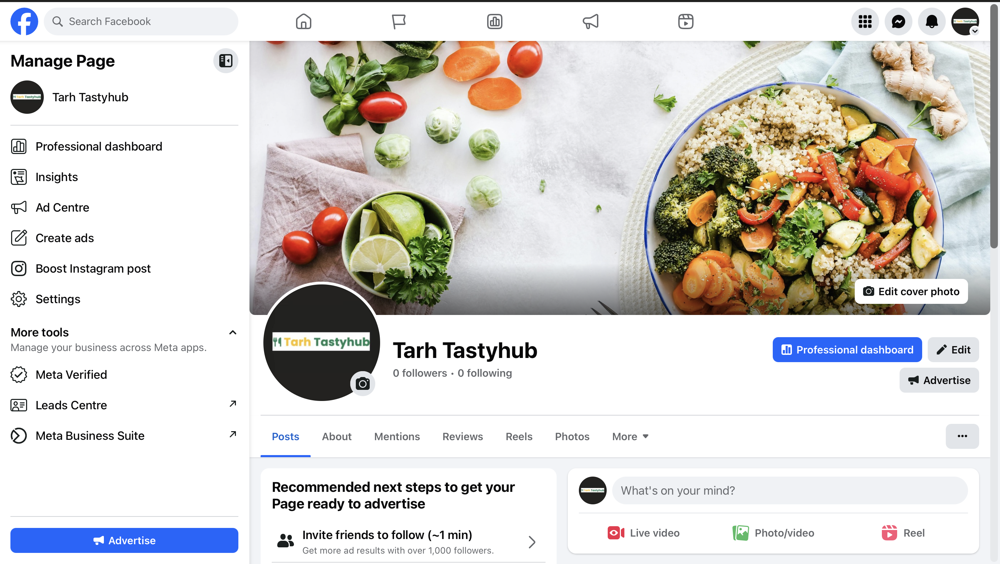

# Tarh TastyHub

Online Food Ordering & Restaurant Marketplace Platform

------
**Deployed website: [Link to website](https://tarh-tastyhub-4071346c00af.herokuapp.com/)**

**Card number for payment testing:** 4242 4242 4242 4242

------

## About

Tarh TastyHub is an online food ordering and restaurant marketplace platform that allows customers to browse restaurant, explore menu, place food orders, and pay securely online for delivery or pickup.

### Platform Features
- User authentication and account management.
- Dish browsing and search functionality. 
- Shopping bag and checkout flow.  
- Secure online payment.
- Discounts, promotions, and loyalty features.  
- Email notifications and order confirmations.
- News letter subcribsion for customer updates.
- Delivery riders, deliver food then its ready for delivery.

### Customer Capabilities
- Browse dishes across search options.  
- Apply delivery discounts.  
- Track order and delivery status.  
- Receive notifications when dishes are being prepared, ready for pickup or out for
  delivery and when delivery is complete. 

### Admin Dashboard
Tarh TastyHub supports multi-role admin dashboard management:  
- Add/edit/delete dish Category and dish.  
- Update order status and cencel oreder if not completed.
- View order details and print receipt. 
- Manage customer feedback. 

This role-based architecture ensures scalability and realistic real-world food delivery functionality.

---

## User Experience

Tarh TastyHub was designed to be modern, intuitive, and user-focused, prioritising ease of use for both customers and restaurant staff.

### Key UX Goals
- Clear and simple navigation  
- Fast access to food categories and dish listings  
- Smooth and frictionless ordering and checkout  

### Encouraging Repeat Usage
- Delivery discount
- Promotional campaigns by mailchimp subscripsion
- Email notifications  
- Dish availability

### Business UX
- Clear dashboard
- Order management tools  
- Staff permissions and access control  

---

## Target Audience

### Customers
- Individuals aged 18+  
- Busy professionals, students, and families  
- Users who value convenience and fast food ordering  
- Customers looking for discounts, quick checkout, and order tracking  

### Businesses
- Restaurant wanting to increase sales online  
- Small to medium food business scale
- Seeking a scalable food ordering solution

---

## User Stories

### First-Time Visitor

| Issue ID | User Story |
|----------|-----------|
| #1 | As a first-time visitor, I want to register an account so that I can place food orders. |
| #2 | As a first-time visitor, I want to understand the purpose of the platform immediately. |
| #3 | As a first-time visitor, I want easy navigation so that I can find menu quickly. |
| #4 | As a first-time visitor, I want to browse restaurant menus without logging in. |
| #5 | As a first-time visitor, I want clear validation messages when registering. |
| #6 | As a first-time visitor, I want to see available discount and dishes. |

### Registered User (Customer)

| Issue ID | User Story |
|----------|-----------|
| #7 | As a customer, I want to stay logged in so I can order faster. |
| #8 | As a customer, I want my personal and payment data to be secure. |
| #9 | As a customer, I want to view my profile and order history. |
| #10 | As a customer, I want to search for dishes|
| #11 | As a customer, I want to save delivery addresses. |
| #12 | As a customer, I want to filter food by category|
| #13 | As a customer, I want to leave reviews for dishes. |
| #14 | As a customer, I want to see featured dishes before ordering. |
| #17 | As a customer, I want to see all available dishes. |
| #18 | As a customer, I want to see discounts offers. |
| #19 | As a customer, I want to know when dishes are max out. |
| #20 | As a customer, I want to know when a dish is unavailable. |
| #21 | As a customer, I want to see full dish details|
| #22 | As a customer, I want to choose portion size|
| #23 | As a customer, I want to edit dish options before ordering. |
| #24 | As a customer, I want to see when a dish is available. |
| #25 | As a customer, I want to receive promotional email notifications. |
| #27 | As a customer, I want to see featured dishes. |
| #30 | As a customer, I want to adjust quantities in my bag. |
| #31 | As a customer, I want to add dishes to my bag. |
| #32 | As a customer, I want to see individual item totals. |
| #33 | As a customer, I want to see the total bag cost. |
| #34 | As a customer, I want to remove items from my bag. |
| #35 | As a customer, I want to track my order status. |
| #36 | As a customer, I want to see order confirmation after checkout. |
| #37 | As a customer, I want to receive an email confirmation of my order. |
| #38 | As a customer, I want to update my profile details. |
| #39 | As a customer, I want to manage multiple delivery |

### Restaurant Manager + Admin

| Issue ID | User Story |
|----------|-----------|
| #40 | As a manager, I want to manage food categories. |
| #41 | As a manager, I want to add, edit, and remove dishes. |
| #42 | As a manager, I want to manage tags (spicy, vegan, gluten-free). |
| #43 | As a manager, I want to manage dish ingredients. |
| #44 | As a manager, I want to send promotions to customers. |
| #45 | As a manager, I want to view customer data if needed. |
| #46 | As a manager, I want to cancel ordered dishes. |
| #48 | As an admin, I want to manage order statuses. |
| #52 | As a manager, I want customers to leave feedback. |

### Logistics / Delivery Manager + Admin

| Issue ID | User Story |
|----------|-----------|
| #53 | As a delivery manager, I want to update order delivery status. |

---

## Business Model

Tarh TastyHub follows a **B2C (Business-to-Customer)** business model:  
- Restaurants sell food directly to customers  
- Platform earns revenue through service fees and promotions  
- Focus on high-frequency, low-value transactions  

---

## Personas

### Customer Persona
- Busy individuals looking for quick meal solutions  
- Wide variety of food choices  
- Discounts benefits  
- Reliable order, pickup and delivery tracking  

### Restaurant Persona
- Seeking increase in sales online 
- Efficient order management  
- Improved customer engagement  
- Scalable food delivery and pickup solution  

---

## Web Marketing

### Email Marketing
- Newsletter campaigns  
- Promotional offers  
- Loyalty discount emails  
*Implemented using mailchimp.com.*

### Social Media
Facebook is a crucial platform for Tarh Tastyhub to connect with customers. According to statistics, the store enjoys strong reach among users who prefer Facebook, making it an effective channel for promoting products and engaging with potential buyers. Facebook’s extensive global coverage ensures access to a wide audience capable of purchasing food online.

The “Tarh Tastyhub” Facebook page serves as the restaurants’s marketing hub. It is used to post advertisements, share exciting content, and actively engage with users, helping to build brand awareness and foster customer interaction.

---

## Future Development
- Live chat support (Django Channels + Redis)  
- Advanced sorting by rating and popularity  
- Third-party authentication (Google login)  
- Additional payment methods (PayPal, Alipay, WeChat Pay, mobile phone)  
- Order cancellation workflow  
- ElasticSearch for faster and more accurate search  
- Advanced delivery cost calculation  
- Sales analytics and reporting dashboard  

---

## Technologies Used

**Languages:**  
Python 3.11.14, JavaScript, HTML5, CSS3  

**Frameworks & Libraries:**  
Django, jQuery, jQuery UI  

**Databases:**  
SQLite (development), PostgreSQL (production)  

**Tools & Services:**  
The project primarily uses Django as the web framework, with django-allauth for authentication and user management. For building and customizing forms, it leverages django-crispy-forms, crispy-bootstrap5, and django-widget-tweaks. PostgreSQL is used as the database, with psycopg2 as the adapter and dj-database-url for configuration. Redis handles caching, while django-ratelimit manages request limits. File storage and media management are supported via django-storages and boto3 for AWS S3 integration. HTTP requests are handled using requests, and payments are processed through Stripe. Deployment relies on Gunicorn, and Pillow is used for image processing. Additional utilities include asgiref, sqlparse, and various packaging and serialization tools like setuptools, wheel, and msgpack.

---

## Features

Full feature breakdown and validation can be found in:
[See TEATURES](FEATURES.md)

---

## Design

Tarh TastyHub follows Material Design principles to ensure clarity, consistency, and accessibility across a complex multi-role system.

The design emphasizes:
- Clear navigation
- Visual hierarchy
- Minimal cognitive load
- Separation between customer and staff experiences

White space is intentionally used to improve readability, highlight primary actions, and support long browsing and management sessions.

---

## Color Scheme

The color palette combines bold accent colors with neutral tones to create a modern and approachable interface.

| Usage Area              | Color     |
|-------------------------|-----------|
| Main Navbar & Footer    | #151422   |
| Admin & Staff Navbar    | #4f378b   |
| Primary Actions         | Accent Purple |
| Backgrounds             | Neutral Light Shades |

---

## Typography

The primary font used across the application is **Lato**, chosen for its high readability and clean appearance.

| Font Weight | Usage               |
|-------------|---------------------|
| 900         | Headings            |
| 700         | Buttons & Highlights|
| 400         | Body Text           |

---

## Imagery

| Type               | Source        |
|--------------------|---------------|
| Background Graphics| BGJar         |
| Dish Images        | Unsplash     |
| Icons              | Font Awesome |

Icons are used extensively to support navigation, dashboards, order tracking, and management tools.

---

## Wireframes

Wireframes were created to plan navigation flow, role separation, and the checkout process.

Wireframes are located in:
`/documentation/design/tastyhub_wireframes.pdf`

---

## Agile Methodology

### GitHub Project Management

Agile development was managed using GitHub Projects, enabling:
- User story prioritization
- Sprint-based development
- Task tracking
- Progress visualization

---

## Flowcharts

| Process                       | Description |
|--------------------------------|-------------|
| Dish Availability Notification | Email alerts when dishes become available |
| Promotion Calculation          | Loyalty and promo code discounts |
| Payment Flow                   | Stripe checkout process |

Flowcharts are located in:
`/documentation/flowcharts/`

---

## Information Architecture

### Database

| Stage        | Database     |
|--------------|--------------|
| Development  | SQLite       |
| Production   | PostgreSQL   |

---

## Entity Relationship Diagram (ERD)

The ERD visualizes all system relationships and data flow.

Location:
`/documentation/my_project_visualized.png`

---

## Data Models

---

### Role Model

| Field       | Type       | Validation |
|-------------|------------|------------|
| name        | CharField  | max_length=50, unique=True |
| description | TextField  | max_length=500, null=True |

---

### Profile Model

Automatically created when a user registers.

| Field        | Type           | Validation |
|--------------|----------------|------------|
| user         | OneToOneField  | User |
| first_name   | CharField      | max_length=50, null=True |
| last_name    | CharField      | max_length=50, null=True |
| avatar       | ImageField     | null=True |
| subscription | BooleanField   | default=False |
| role         | ForeignKey     | Role, default=Customer |
| created_at   | DateTimeField  | auto_now_add |
| updated_at   | DateTimeField  | auto_now |

Roles can only be modified by Admin users to ensure security.

---

### Address Model

Supports multiple delivery addresses.

| Field        | Type |
|--------------|------|
| user         | ForeignKey |
| city         | CharField |
| address_line | CharField |
| zip_code     | CharField |
| phone_number | CharField |
| is_primary   | BooleanField |

---

### Restaurant Model

| Field       | Type |
|-------------|------|
| name        | CharField |
| description | TextField |
| is_active   | BooleanField |
| created_at  | DateTimeField |

---

### Category Model

| Field     | Type |
|-----------|------|
| name      | CharField |
| slug      | SlugField |
| is_active | BooleanField |

---

### Tag Model

| Field     | Type |
|-----------|------|
| name      | CharField |
| slug      | SlugField |
| is_active | BooleanField |

---

### Dish Model

| Field        | Type |
|--------------|------|
| name         | CharField |
| description  | TextField |
| price        | DecimalField |
| restaurant   | ForeignKey |
| category     | ForeignKey |
| tags         | ManyToManyField |
| is_available | BooleanField |

---

### DishImage Model

| Field      | Type |
|------------|------|
| dish       | ForeignKey |
| image      | ImageField |
| is_primary | BooleanField |

---

### Cart Model

| Field      | Type |
|------------|------|
| user       | ForeignKey |
| created_at | DateTimeField |

---

### Order Model

Order status values:
Pending, Processing, Out for Delivery, Completed, Cancelled

| Field        | Type |
|--------------|------|
| user         | ForeignKey |
| total_paid   | DecimalField |
| order_number | CharField |
| status       | CharField |
| created_at   | DateTimeField |

---

### OrderItem Model

| Field            | Type |
|------------------|------|
| order            | ForeignKey |
| dish             | ForeignKey |
| quantity         | PositiveIntegerField |
| selected_options | JSONField |

---

### Promotion Model

| Field                | Type |
|----------------------|------|
| name                 | CharField |
| promotion_code       | CharField |
| discount_percentage  | IntegerField |
| start_date           | DateTimeField |
| end_date             | DateTimeField |
| is_active            | BooleanField |

---

### Review Model

Reviews can only be submitted after an order is completed.

| Field   | Type |
|---------|------|
| user    | ForeignKey |
| dish    | ForeignKey |
| order   | ForeignKey |
| rating  | IntegerField |
| comment | TextField |

---

### Notification Models

| Type                     | Purpose |
|--------------------------|---------|
| Email Notifications      | Orders and promotions |
| Dish Availability Alerts | Back-in-stock requests |

---

## Testing

All testing documentation is available in:
[TESTING.md](TESTING.md)

Includes:
- User story validation
- Manual test cases
- Form validation
- Bug tracking

---

## Deployment and Payment Setup

| Component | Service |
|----------|---------|
| Hosting  | Render |
| Database | PostgreSQL |
| Payments | Stripe |

Stripe test card:
4242 4242 4242 4242

Deployment instructions are available in:
[DEPLOYMENT.md](DEPLOYMENT.md)

---

## Credits

| Resource      | Purpose |
|---------------|---------|
| Django        | Web framework |
| Stripe        | Payments |
| Render        | Hosting |
| Font Awesome  | Icons |
| Unsplash      | Food imagery |
| BGJar         | Backgrounds |
| Coolors       | Color palette |
| Very Academy  | Learning reference |

---

## Acknowledgments

| Contributor       | Contribution |
|-------------------|-------------|
| Project Mentors   | Technical guidance |
| Peer Reviewers    | UX feedback |
| Very Academy      | Django & Stripe insights |
