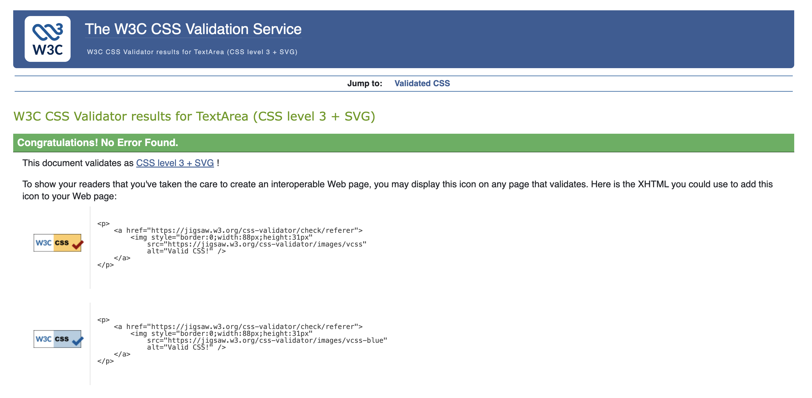
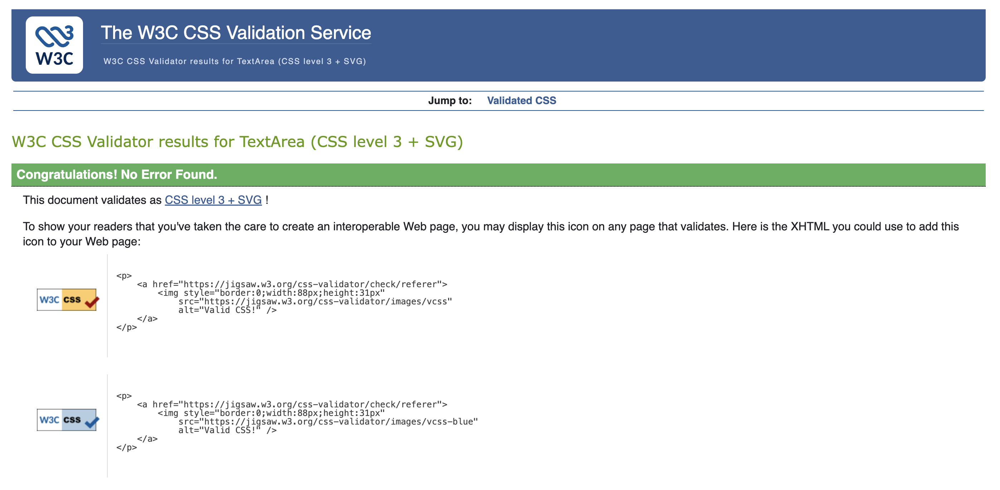
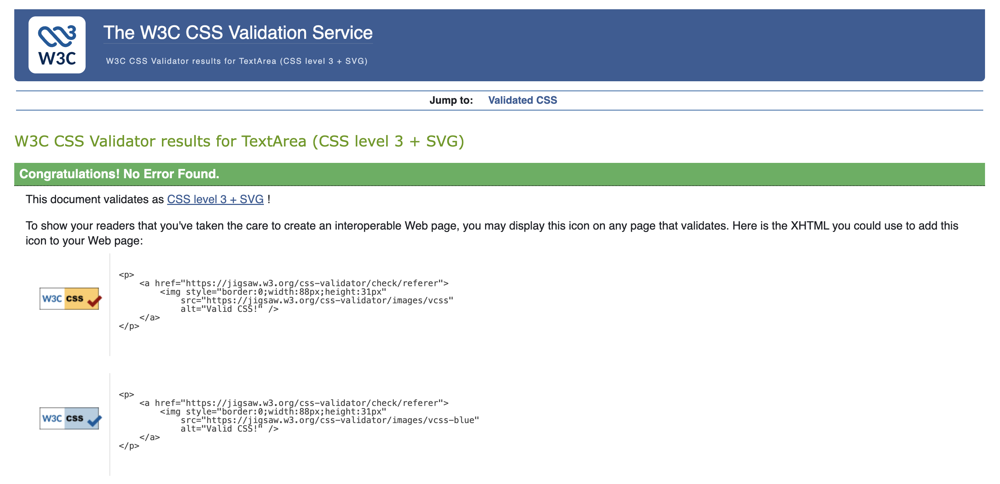

# TESTING

## Manual Testing

This is a comprehensive manual testing file, covering all pages, user actions, clicks, form entries, navigation, modals, and success/error messages. Usability was tested with user acceptance testing sent to different users on different devices and browsers to ensure issues were caught and fixed where possible.

---

## Navbar page

| Page                | User Actions                    | Expected Results                  | Y/N | Comments              |
| ------------------- | ------------------------------- | --------------------------------- | --- | --------------------- |
| Navbar              | Click on Logo                   | Redirects to Home page            | Y   |                       |
| Navbar              | Click Home link                 | Redirects to Home page            | Y   |                       |
| Navbar              | Click Dish Category link        | Redirects to Dishes Category page | Y   |                       |
| Navbar              | Click Browse Dishes link        | Redirects to Browse Dishes page   | Y   |                       |
| Navbar              | Click Checkout link             | Redirects to Checkout page        | Y   |                       |
| Navbar              | Click Contact link              | Redirects to Custome Feedback page| Y   |                       |
| Navbar (Logged In)  | Click Profile button            | Redirects to Profile page         | Y   |                       |
| Navbar (Logged In)  | Click Logout button             | Redirects to Signout page         | Y   |                       |
| Navbar (Logged Out) | Click Login button              | Redirects to Signin page          | Y   |                       |
| Navbar (Logged Out) | Click SignUp button             | Redirects to SignUp page          | Y   |                       |
| Navbar (Staff)      | Click Admin Dashboard button    | Redirects to Admin Dashboard page | Y   | Visible only to staff |
| Navbar              | Delivery Information            | Discount message displayes        | Y   | Visible to all users  |

---

## Footer page

| Page   | User Actions               | Expected Results                     | Y/N | Comments |
| ------ | -------------------------- | ------------------------------------ | --- | -------- |
| Footer | Click Home                 | Redirects to Home page               | Y   |          |
| Footer | Click Dish Category link   | Redirects to Dishes Category page    | Y   |          |
| Footer | Click Browse Dishes link   | Redirects to Browse Dishes page      | Y   |          |
| Footer | Click Contact button       | Redirects to Custome Feedback page   | Y   |          |
| Footer | Click Privacy Policy       | Redirects to Privacy Policy page     | Y   |          |
| Footer | Click Terms and Conditions | Redirects to Terms & Conditions page | Y   |          |
| Footer | Click Facebook button      | Opens Facebook page                  | Y   |          |
| Footer | Subscribe via email        | Subscribes user to mailing list      | Y   |          |

---

## Home Page

| Page | User Actions                       | Expected Results                      | Y/N | Comments |
| ---- | ---------------------------------- | ------------------------------------- | --- | -------- |
| Home | Click Order button in Hero section | Redirects to Dishes page              | Y   |          |
| Home | Scroll to Featured Dishes          | Featured dishes displayed in cards    | Y   |          |
| Home | Click on dish View detail.         | Redirects to Dish Detail page         | Y   |          |
| Home | Scroll to Testimonials             | Testimonials displayed                | Y   |          |

---

## Dishes Category and Browse Dishes Pages

| Page            | User Actions            | Expected Results                                   | Y/N  | Comments   |
| --------------- | ----------------------- | -------------------------------------------------- | -----| ------------
| Category/Browse | Type in search bar      | Search results displayed                           | Y   |             |
| Category/Browse | Filter by category      | Relevant dishes displayed                          | Y   |             |
| Category/Browse | Filter by price         | Relevant dishes displayed                          | Y   |             |
| Category/Browse | Filter by dietary type  | Relevant dishes displayed                          | Y   |             |
| Category/Browse | Filter by ingredients   | Relevant dishes displayed                          | Y   |             |
| Category/Browse | Click dish view detail  | Redirects to Dish Detail page                      | Y   |             |
| Category/Browse | Click All.              | All dishes displayed                               | Y   |             |
| Category/Browse | Click Add to Bag button | Dish added to bag, notification displayed          | Y   | If logged out, prompt to login |
| Category/Browse | Click quantity + / -    | Quantity updated                                   | Y   | If logged out, prompt to login |
| Category/Browse | Click bag icon          | Redirecstnto your bag page                         | Y   |If logged out, prompt to login |
| Category/Browse | Click bag icon          | Redirecstnto your bag page                         | Y   |If logged out, prompt to login |

| Category/Browse | Click Remove from Bag   | Dish removed from bag, notification displayed      | Y   |             |

---

## Dish Detail Page

| Page        | User Actions            | Expected Results                          | Y/N | Comments |
| ----------- | ----------------------- | ----------------------------------------- | ----- | ------
| Dish Detail | Click Add to Bag button | Dish added to bag, notification displayed | Y   | If logged out, prompt to login |
| Dish Detail | Click quantity + / -    | Quantity updated                          | Y   | If logged out, prompt to login |
| Dish Detail | View Ingredients        | Ingredients displayed                     | Y   |          |
| Dish Detail | View Dietary info       | Dietary info displayed                    | Y   |          |
| Dish Detail | Click Browse Dishes     | Redirects to previous page, dishes page   | Y   |          |
| Dish Detail | Click size dropdown.    | Dish sizes displayed.                     | Y   |          |
| Dish Detail | Click desired dish size | Dish size displayed.                      | Y   |          |

---

## Your Bag and Checkout Pages

| Page     | User Actions                 | Expected Results                           | Y/N | Comments |
| -------- | ---------------------------- | ------------------------------------------ | --- | ---------|
| Bag      | Click Remove item            | Item removed, totals updated               | Y   |          |
| Bag      | Change quantity + / -        | Quantity updated, totals updated           | Y   |          |
| Bag      | Click Checkout               | Redirects to Checkout page                 | Y   |          |
| Checkout | Fill in Name, Address, Phone | Fields accept input                        | Y   |          |
| Checkout | Select delivery type.        | Delivery type selectable                   | Y   |          |
| Checkout | Click pay now.               | Order processed, redirects to Success page | Y   | Success page displays order summary |
| Checkout | Invalid/missing info         | Error message displayed                    | Y   | Form validation |

---

## Success Page

| Page    | User Actions               | Expected Results          | Y/N | Comments |
| ------- | -------------------------- | ------------------------- | --- | -------- |
| Success | Click go to my profile     | Redirects to profile page | Y   |          |
| Success | Click continue shopping    | Redirects to dishes page  | Y   |          |

---

## Feedback Page

| Page     | User Actions                        | Expected Results               | Y/N | Comments        |
| -------- | ----------------------------------- | ------------------------------ | --- | --------------- |
| Feedback | Enter Name, Email, subject, Message | Fields accept input            | Y   | logged out user |
| Feedback | Enter subject, Message              | Fields accept input            | Y   | logged in user  |
| Feedback | Click Submit Feedback               | Confirmation message displayed | Y   |                 |
| Feedback | Leave field empty                   | Error message displayed        | Y   | Form validation |

---

## My Profile Page

| Page    | User Actions                 | Expected Results                   | Y/N | Comments                    |
| ------- | ---------------------------- | ---------------------------------- | --- | --------------------------- |
| Profile | Update telephone, address    | Fields accept input                | Y   |                             |
| Profile | Click Update profile         | Changes saved                      | Y   | Success message displayed   |
| Profile | Invalid input                | Error message displayed            | Y   |                             |
| Profile | View Order History           | Orders listed                      | Y   | Click to view order details |

---

## Admin Dashboard

### Orders Management

| Page         | User Actions        | Expected Results                     | Y/N | Comments |
| ------------ | ------------------- | ------------------------------------ | --- | -------- |
| Admin Orders | View all orders     | Orders displayed                     | Y   |          |
| Admin Orders | Click view details  | Opens order details modal            | Y   |          |
| Admin Orders | Update order status | Status updated, confirmation message | Y   |          |
| Admin Orders | Click cancel        | cancel page opens, confirm.          | Y   |          |
| Admin Orders | Click print         | print page opens, print.             | Y   |          |

### Dishes Management

| Page         | User Actions | Expected Results                            | Y/N | Comments                  |
| ------------ | ------------ | ------------------------------------------- | --- | ------------------------- |
| Admin Dishes | Add Dish     | add dish page opens, add dish, successful   | Y   | Success message displayed |
| Admin Dishes | Edit Dish    | edit dish page opens, edit dish, successful | Y   | Success message displayed |
| Admin Dishes | Delete Dish  | delete dish page opens, delete confirmation | Y   | Success message displayed |

### Categories 

| Page              | User Actions       | Expected Results                                        | Y/N | Comments                  |
| ----------------- | ------------------ | -------------------------------------------------------- | --- | -------------|
| Admin Categories  | Add Categories     | add Categories page opens, add Categories , successful   | Y   | Success message displayed |
| Admin Categories  | Edit Categories    | edit Categories page opens, edit Categories , successful | Y   | Success message displayed |
| Admin Categories  | Delete Categories  | delete Categories page opens, delete confirmation        | Y   | Success message displayed |

### Feedback

| Page     | User Actions                        | Expected Results                   | Y/N | Comments        |
| -------- | ----------------------------------- | ---------------------------------- | --- | --------------- |
| Feedback | Select unread, Apply                | All unread messages display        | Y   |                 |
| Feedback | Select handled , Apply              | All handles messages display       | Y   |                 |
| Feedback | Click mark as handled               | Message displayed as handled       | Y   |               |
| Feedback | Click handled                       | Message displayed as display mark as handled | Y   |           |

---

## Testing User Stories

| User Story ID | User Story | Requirement Met |
| ------------- | ---------- | --------------- |
| US01 | As a Customer, I want to view a list of dishes, so that I can select some to order. | Y |
| US02 | As a Customer, I want to view dishes by category (e.g., Breakfast, Dinner, dLunch), so that I can quickly find what I want. | Y |
| US03 | As a Customer, I want to view details of a dish, so that I can see description, ingredients, image, portion size, and price. | Y |
| US04 | As a Customer, I want to identify featured dishes, so that I can take advantage of offers. | Y |
| US05 | As a Customer, I want to view my total order cost at any time, so that I can manage my budget. | Y |
| US06 | As a Site User, I want to register an account, so that I can save my details and order history. | Y |
| US07 | As a Site User, I want to log in and log out, so that my account is secure. | Y |
| US08 | As a Site User, I want to recover my password, so that I can regain access if I forget it. | Y |
| US09 | As a Site User, I want to receive email confirmation after registering, so that I know my account is created. | Y |
| US10 | As a Site User, I want a personalised profile, so that I can view order history, saved addresses, and preferences. | Y |
| US11 | As a Customer, I want to sort dishes by price, so that I can find the best options. | Y |
| US12 | As a Customer, I want to sort dishes within a category, so that I can find dishes in that category. | Y |
| US13 | As a Customer, I want to search for dishes by name or ingredients, so that I can quickly find what I want. | Y |
| US14 | As a Customer, I want to view search results clearly, so that I can decide whether the dish I want is available. | Y |
| US15 | As a Customer, I want to select portion size and quantity for each dish, so that I order exactly what I want. | Y |
| US16 | As a Customer, I want to view all dishes in my cart, so that I can confirm my selections. | Y |
| US17 | As a Customer, I want to adjust quantities or remove dishes in my cart, so that I can change my order easily. | Y |
| US18 | As a Customer, I want to enter payment information securely, so that I can complete my order safely. | Y |
| US19 | As a Customer, I want to see order confirmation after checkout, so that I know my order was successful. | Y |
| US20 | As a Customer, I want to receive an email confirmation after checkout, so that I can keep a record of my order. | Y |
| US21 | As an Admin, I want to add new dishes, so that I can expand my menu. | Y |
| US22 | As an Admin, I want to edit dish details, so that I can update pricing, images, descriptions, or availability. | Y |
| US23 | As an Admin, I want to delete dishes, so that I can remove items no longer offered. | Y |
| US24 | As a Customer, I want to submit feedback on dishes, so that I can share my opinion or report issues. | Y |
| US25 | As a Site User, I want to update my profile, so that my personal information and delivery preferences are current. | Y |
| US26 | As a Site User, I want to view past orders, so that I can reference previous dishes I liked. | Y |
| US27 | As a Site User, I want to delete my account, so that my personal data and order history are removed. | Y |
| US28 | As a Site User, I want to change my password, so that I can maintain account security. | Y |

---

## Bugs

**Solved bugs:**
1. I was getting an error message when I tried to test the JsonResponse response on Password change.

**Unsolved bugs:**

1. When I was using attributes for the `id=""` and `for=""` attributes for the inputs, I was getting html errors regarding spaces between words. 

*Temporary Solution:*

I was temporary able to resolve this issue by adding `-` rather than ` ` in the DB manually. The decision to take use this shortcut was made because of the lack of time and the js logic and python logic were implemented earlier.

*Future Solution:*

Replace the ` ` with `-` in ProductDetail View `.replace(" ", "-")`, then adjust javascript logic for the selected elements, then `.replace("-", " ")` in the AddToBagAJAXView, PromoCodeAJAXView, AddRemoveProductWishlistAJAXView, EmailStockNotificationFormAJAX and test the functionality.

2. The error appeared in console when payment was processing once during the final testing. I've tried many times to reproduce it, but haven't been able to. Include any links you found that show it might be random from stripe, and that it's out of your control at this time, but will keep an eye on it for potential future issues

*Explanation:*

It might be coming from stripe itself because and I'm not able to fix it. Here is the link to the issue from github and the information provided.

[react-stripe-elements. Uncaught (in promise) undefined #408](https://github.com/stripe-archive/react-stripe-elements/issues/408)

---

## Validation

### HTML Validation:

- No errors or warnings were found when passing through the official [W3C](https://validator.w3.org/) validator. This checking was done manually by copying the view page source code (Ctrl+U) and pasting it into the validator.

- [Home page link HTML validation report](documentation/validation/home_html_validation.png)

- [Home page link HTML validation report](documentation/validation/bag_html_validation.png)

- [Home page link HTML validation report](documentation/validation/bag_html_validation.png)

- [Home page link HTML validation report](documentation/validation/bag_html_validation.png)

- [Home page link HTML validation report](documentation/validation/bag_html_validation.png)

- [Home page link HTML validation report](documentation/validation/bag_html_validation.png)

- [Home page link HTML validation report](documentation/validation/bag_html_validation.png)

- [Home page link HTML validation report](documentation/validation/bag_html_validation.png)

- [Home page link HTML validation report](documentation/validation/bag_html_validation.png)

- [Home page link HTML validation report](documentation/validation/bag_html_validation.png)

- [Home page link HTML validation report](documentation/validation/bag_html_validation.png)

- [Home page link HTML validation report](documentation/validation/bag_html_validation.png)

- [Home page link HTML validation report](documentation/validation/bag_html_validation.png)

- [Home page link HTML validation report](documentation/validation/bag_html_validation.png)

- [Home page link HTML validation report](documentation/validation/bag_html_validation.png)

- [Home page link HTML validation report](documentation/validation/bag_html_validation.png)

- [Home page link HTML validation report](documentation/validation/bag_html_validation.png)

- [Home page link HTML validation report](documentation/validation/bag_html_validation.png)

- [Home page link HTML validation report](documentation/validation/bag_html_validation.png)

- [Home page link HTML validation report](documentation/validation/bag_html_validation.png)

- [Home page link HTML validation report](documentation/validation/bag_html_validation.png)

- [Home page link HTML validation report](documentation/validation/bag_html_validation.png)

- [Home page link HTML validation report](documentation/validation/bag_html_validation.png)

- [Home page link HTML validation report](documentation/validation/bag_html_validation.png)

- [Home page link HTML validation report](documentation/validation/bag_html_validation.png)

- [Home page link HTML validation report](documentation/validation/bag_html_validation.png)

- [EmailNotification app HTML validation report](documentation/validation/email_notification_html_validation.pdf)

### CSS Validation:

 No errors or warnings were found when passing through the official [W3C (Jigsaw)](https://jigsaw.w3.org/css-validator/#validate_by_uri) validator except for the warnings about the use of css root variables and webkits for the box-shadow. However, css code works perfectly on various devices.

 - Base.css

 

  - Index.css

 

 - Dishes.css

  

 - Checkout.css

 

### JS Validation:

- [Full JS Validation Report](documentation/validation/js_validation.pdf)

- No errors or warning messages were found when passing through the official [JSHint](https://www.jshint.com/) validator. However, to validate js full `/* jshint esversion: 8, jquery: true, scripturl: true */` was added to the top of the file.

### Python Validation:

- No errors were found when the code was passed through Valentin Bryukhanov's [online validation tool](http://pep8online.com/). According to the reports, the code is [Pep 8-compliant](https://legacy.python.org/dev/peps/pep-0008/). This checking was done manually by copying python code and pasting it into the validator.

- [Bag. Validation Report](documentation/validation/pep8_validation_bag.pdf)

- [Email_notifications. Validation Report](documentation/validation/pep8_validation_email_notifications.pdf)

- [Home. Validation Report](documentation/validation/pep8_validation_home.pdf)

- [Inventory. Validation Report](documentation/validation/pep8_validation_inventory.pdf)

- [Orders. Validation Report](documentation/validation/pep8_validation_orders.pdf)

- [Payment. Validation Report](documentation/validation/pep8_validation_payment.pdf)

- [Personnel. Validation Report](documentation/validation/pep8_validation_personnel.pdf)

- [Profiles. Validation Report](documentation/validation/pep8_validation_profiles.pdf)

- [Promotions. Validation Report](documentation/validation/pep8_validation_promotions.pdf)

- [Reviews. Validation Report](documentation/validation/pep8_validation_reviews.pdf)

- [Wishlist. Validation report](documentation/validation/pep8_validation_wishlist.pdf)

---
## Lighthouse Report

LightHouse is a web performance testing tool that can be used to evaluate the performance of a website. The report is generated by Google Chrome.

[Lighthouse Report](documentation/testing/lighthouse_report.pdf)

---

## Compatibility

Testing was conducted on the following browsers;

- Safari;
- Chrome;
- Firefox;

[Compatibility Report](documentation/validation/compatibility.pdf)

---
## Responsiveness

The responsiveness was checked manually by using devtools (Chrome) throughout the whole development. It was also checked with [Responsive Viewer](https://chrome.google.com/webstore/detail/responsive-viewer/inmopeiepgfljkpkidclfgbgbmfcennb/related?hl=en) Chrome extension.

[Responsiveness Report](documentation/testing/responsiveness.pdf)

---
